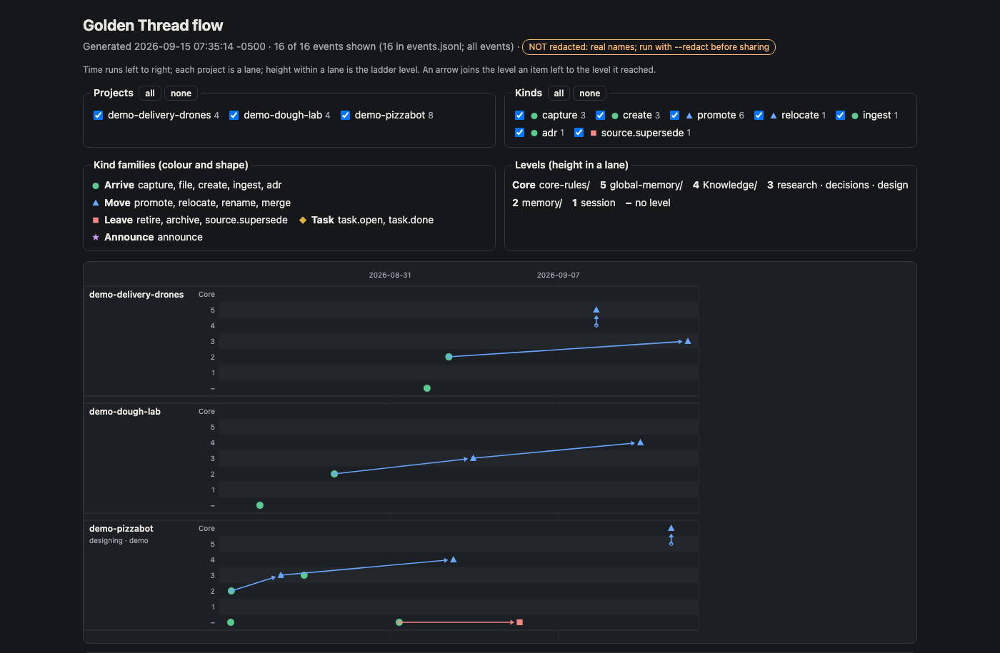

# Golden Thread

> **Reader:** someone who has never heard of Golden Thread
> **Claims last checked against the code:** 2026-09-17 — see *The documents, and what belongs in each* in [`CLAUDE.md`](CLAUDE.md).

A memory system for AI coding sessions, built on plain markdown and git — and,
unusually, one where the rules that matter most are **mechanically enforced** rather
than merely written down.

Every AI session starts with amnesia. You explain your conventions, the session does
good work, the session ends, and it is all gone. Golden Thread is one Obsidian vault
that acts as shared memory between you and every session you run: sessions read from
it at startup, look things up while working, and write back what they learn.

Its distinguishing idea is the second problem, the one most memory systems never
address: **writing a rule down does not mean it gets followed.**

Plugin **v0.16.3**. Ten Core rules currently enforced, five of them *validated* — a
hook inspects the finished reply (`Stop`) or the tool call about to run (`PreToolUse`)
and blocks it if the rule was broken.


> [!IMPORTANT]
> **0.16.2 closes the seam where the rules went quiet.** Context a hook adds does not
> survive compaction — project-root `CLAUDE.md` is re-injected from disk, hook context is
> summarised with everything else — so for the remainder of a turn in which auto-compaction
> fired, the Core rules were present only as whatever the summariser kept. They are now
> re-asserted on `SessionStart`/`compact` as well as every prompt. The mechanical tier was
> never affected: `PreToolUse` guards and the `Stop` validator are commands, not context.
>
> Also: `SessionEnd` hooks share a 1.5-second budget, and a hook that overruns is cancelled
> with its **output discarded** — a report card could have started truncating invisibly. Hooks
> can now declare a `timeout`. And the copyleft refusal knows the current SPDX spellings, so
> `GPL-3.0-or-later` is refused *as copyleft* rather than as an unrecognised identifier.
>
> **`/gt:gt-context` is explicit that its envelope is not a security control.** Published work
> (arXiv:2503.00061) broke all eight defences it tested, above 50% attack success in every
> case. The envelope makes content identifiable as someone's definition; what actually protects
> you is that packs are reviewed before merge.

> [!NOTE]
> **0.16.0 gave the definitions somewhere to come from, and something to read them.**
> Golden Thread has **no plugin runtime** — nobody's code runs on your machine as a
> third-party add-on. Contributions arrive as **packs**: plain JSON data, reviewed and
> merged into gt itself, after which they are first-party and held to the same release
> gate as everything else. See [SUBMISSIONS.md](SUBMISSIONS.md).
>
> The packs now have consumers. **`/gt:gt-scan`** checks code against the language
> definitions in effect on this machine — and knows nothing about any language itself, so
> four small packs teach it one it has never seen, with no code change. **`/gt:gt-optimize`**
> reports vault content that costs context and earns nothing back. **`/gt:gt-handoff`**
> writes the next session a handoff that marks what it must not assume. **`/gt:gt-allin`**
> runs every check and tells you how many actually *ran*, and **`/gt:gt-allin-commit`**
> commits only once a passing test receipt covers every staged file.
>
> A definition you disagree with is switched off from your own vault:
> `{"retract": [{"lang": "go"}]}`. Only your packs may retract, so a contributed pack can
> never retire someone else's definition.

> [!NOTE]
> **0.15.0 made gt a small core plus six optional modules**, and an upgrade no longer
> changes anything you wrote without saying so and asking. Three commands moved
> (`/gt:gt-watch` → `/gt-watch:gt-watch`, `/gt:gt-farm` → `/gt-farm:gt-farm`,
> `/gt:gt-demo` → `/gt-demo:gt-demo`), and the installer tells you. New with it: the vault
> records how knowledge moves as events, and **`/gt-flow:gt-flow` draws it** — see
> [Seeing how knowledge moved](#seeing-how-knowledge-moved). Choose modules with
> `install.sh --list-modules`, `--without <name>` and `--with <name>`; details in the
> [CHANGELOG](CHANGELOG.md).

> [!NOTE]
> **Since 0.12.4, work runs in parallel by default, and you will notice it.** A Core rule now
> asks for divisible work to be split across your processors instead of crawling through
> one core, and the tools here honour it: `tests/run.sh` and `dev/render-pdfs.sh` fan out,
> and so will anything Claude writes while the rule is active. **The first sign is
> usually your fans** — a suite that used to hold one core at 100% now holds sixteen at
> 400%+, and Activity Monitor fills with `python3` or `Google Chrome` processes that all
> disappear when the run ends. That is the feature working, not a runaway job. The
> measurement behind it: the test suite went from 509s to 108s, 4.7x.
>
> **You are in charge of how much of your machine it may use.**
>
> ```bash
> gt_settings.py set parallel_max 4      # never more than 4 workers, whatever the work
> gt_settings.py set parallel_work off   # serial, and the Core rule stops being injected
> gt_settings.py show                    # what is currently allowed
> ```
>
> **Also new in 0.12.5:** a `git commit` carrying code whose tests have not been seen to
> pass is **refused**. Evidence is a receipt written by your test run (`tests/run.sh` and
> `dev/release-check.sh` write their own; any project can with `gt_test_receipt.py record
> --ok`). If a repo has no tests, exempt it once with `touch .gt-no-test-gate`; for a
> single commit, `GT_TEST_GATE=off git commit …`; to switch it off entirely,
> `gt_settings.py set test_gate off`. Docs-only commits are never blocked.
>
> `parallel_max` defaults to `auto` — as many workers as the machine allows, and never
> more than there are units of work. Cap it before a long run if you need the machine to
> stay responsive for something else, if you are on battery, or if a remote end is
> rate-limited. `off` is the full stop: nothing runs in parallel and the rule is not
> asserted at all.

## Who this is for

You run several projects at once and the ideas never arrive in the right one. You are
deep in project A when the fix for project B occurs to you, a session ends before the
finding is written down, and by Monday you cannot remember which of the six things you
touched last week was the urgent one. If your attention scatters, from ADHD or simply
from load, a system that depends on remembering to file things in the right place will
not hold.

Golden Thread is built so that **capture never waits for the right context.** Write the
thought as one line in the vault's inbox, from whatever session or project you happen
to be in. A review sweep later routes each line to the project it belongs to. Every project keeps its open tasks in one place, and a single
generated rollup ranks them across *all* projects, escalating by age and deadline, so
"what should I work on?" has one answer instead of six status pages.

The result is one place to look. Sessions read from it at startup, write back what they
learned at the end, and the rules you most need to hold are re-asserted every turn
instead of trusted to memory.

## Feedback

If you are using Golden Thread, or tried it and bounced off, I would like to hear about
it. Questions, ideas, and "this worked for me" belong in
[Discussions](https://github.com/shaven/golden-thread/discussions). Bugs and anything
that behaved differently from the documentation belong in
[Issues](https://github.com/shaven/golden-thread/issues). Both are read.

## "In context" is not "applied"

A rule can sit in a loaded file for an entire session and still be quietly dropped for
dozens of turns — not because it was deleted, but because whatever is immediately
salient crowds it out of attention.

So a rule is only as durable as *the mechanism that re-asserts it*. Every rule carries
a **scope** (`core` / `context` / `generic`) and an **enforcement** (`reminder`, which
is re-injected every turn, or `validated`, where the output is checked and a violating
reply is blocked). A rule that must never break is Core + Validated — the only
combination that does not depend on in-the-moment discipline.

The Core tier is deliberately small; every addition dilutes the reliability of the rest.

| Rule | Enforcement | What it does |
|---|---|---|
| `core_concurrent_session_claim` | **validated** | Register the session and claim a vault file before writing it; never write one another live session holds |
| `core_no_secrets_in_transcript` | **validated** | Never put a secret's value into the session — not to inspect, redact or check it |
| `core_timestamp_every_message` | **validated** | Begin every reply with the current wall-clock timestamp |
| `core_global_memory_scope` | reminder | `global-memory/` holds only facts needed in *every* project |
| `core_memory_load_policy` | reminder | Do not auto-load the full memory index |
| `core_verification_state` | reminder | Label every derived figure with `unverified`, `self-verified` or `independently verified` |
| `core_explicit_vault_target` | **validated** | Name the vault on every mutating tool run — `--vault` or `--dry-run` |
| `core_secrets_live_in_the_store` | reminder | A secret's value rests only in the secrets store, never in source, a repo, a log or a session |
| `core_parallel_when_beneficial` | reminder | Parallelise divisible work in every project, within one `parallel_max` budget shared by every session on the machine; serial must be justified |
| `core_test_before_commit` | **validated** | Never commit code whose tests you have not seen pass; per-repo opt-out with `.gt-no-test-gate` |

Two ways in: the user **designates** a rule, or an existing fact is **promoted** and
must answer three questions — would its absence cause incorrect code, cause rework, or
cascade into lower-level rules being written wrongly?

Two of the validated rules show why both paths exist. `core_no_secrets_in_transcript`
answers yes to all three. `core_timestamp_every_message` answers **no to all three** and
is Core anyway: it is the *canary*, kept because its absence is visible rather than
costly, so a broken hook announces itself.

## What is in this repo

| Path | What it is |
|---|---|
| `golden-thread-plugin/golden-thread/<ver>/` | The `gt` plugin — 23 skills, scripts, templates, hooks, packs |
| `golden-thread-plugin/golden-thread-wiki/<ver>/` | Module `wiki` (plugin `gt-wiki`) — 5 skills for LLM wiki vaults |
| `golden-thread-plugin/golden-thread-demo/<ver>/` | Module `demo` (plugin `gt-demo`) — the guided PizzaBot 3000 tour |
| `golden-thread-plugin/golden-thread-watch/<ver>/` | Module `watch` (plugin `gt-watch`) — follow upstream git repos, P0 on a security fix |
| `golden-thread-plugin/golden-thread-report-card/<ver>/` | Module `report-card` (plugin `gt-report-card`) — the session report card and close-out question |
| `golden-thread-plugin/golden-thread-farm/<ver>/` | Module `farm` (plugin `gt-farm`) — work packets for an external AI service |
| `golden-thread-plugin/golden-thread-flow/<ver>/` | Module `flow` (plugin `gt-flow`) — an offline timeline of knowledge moving up the ladder |
| `golden-thread-plugin/install.sh` | Installs gt and every module that is on, wires the hooks, applies upgrades |

The vault *content* lives in a separate private repo. This one is the machinery.

## Documentation

The guides live one level down, under [`golden-thread-plugin/`](golden-thread-plugin/),
alongside the code they describe. Start with Getting Started; the Manual is the reference.

| Document | What it covers |
|---|---|
| [Changelog](CHANGELOG.md) | What changed in each release, newest first |
| [Announcements](../../discussions/categories/announcements) | Release write-ups: what broke, what changed, and what you have to do |
| [Getting Started](golden-thread-plugin/ONBOARDING.md) · [PDF](golden-thread-plugin/ONBOARDING.pdf) | A guided first session in six steps, about fifteen minutes |
| [User Manual](golden-thread-plugin/MANUAL.md) · [PDF](golden-thread-plugin/MANUAL.pdf) | Complete reference: every skill, the vault layout, verification, the promotion ladder |
| [Install Guide](golden-thread-plugin/INSTALL.md) | Installing gt and its modules, choosing modules, upgrading and rolling back, wiring the hooks, adopting an existing vault |
| [Obsidian & Daily Workflow](golden-thread-plugin/OBSIDIAN-WORKFLOW.md) · [PDF](golden-thread-plugin/OBSIDIAN-WORKFLOW.pdf) | Living in the vault day to day — daily notes, properties, Dataview |
| [Developer Guide](golden-thread-plugin/golden-thread-developer-guide.html) · [PDF](golden-thread-plugin/golden-thread-developer-guide.pdf) | Internals: hooks, scripts, the component manifest, extending the plugin |
| [Plugin Documentation](golden-thread-plugin/golden-thread-docs.md) · [HTML](golden-thread-plugin/golden-thread-docs.html) · [PDF](golden-thread-plugin/golden-thread-docs.pdf) | The combined document — overview, Core rules, every skill, install and operation, in one file. Refreshed to current on 2026-09-09 (it had been frozen at gt 0.6.0 for six releases); now tracks the shipped release and is checked for drift by `build-docs.py` |
| [`docs/workflow.html`](docs/workflow.html) · [`docs/ingesting.html`](docs/ingesting.html) | Standalone diagrams of the work and ingest loops |
| `golden-thread.pdf` | The earliest write-up here (2026-08-10); predates the current plugin layout, kept for reference |

The PDFs and HTML are rendered from the markdown beside them — when the two disagree,
**the markdown is the source of truth.**

## Install

```bash
bash golden-thread-plugin/install.sh --vault <path>
# then restart Claude Code — plugins and hooks load at session start
```

That installs gt and every **module** that is on. Six ship: `wiki`, `demo`,
`watch`, `report-card` and `flow` are on by default; `farm` is off for a fresh install and
kept on when you upgrade from a gt that had `/gt:gt-farm`. Choose with `--list-modules`,
`--without <name>` and `--with <name>`; the choice is remembered. Re-running it upgrades from any older release to
the newest, removing what old releases left behind and applying vault upgrades when your
vault is committed. See the [Install Guide](golden-thread-plugin/INSTALL.md).

Scaffold a vault, or adopt an existing one:

```bash
python3 <plugin>/scripts/vault_init.py fresh --vault <path> --domain <name>
python3 <plugin>/scripts/vault_init.py install-core-rules --vault <path>
```

**Verify enforcement is live** — a rule that is not wired is not a rule:

```bash
echo '{}' | ~/.claude/golden-thread/hooks/inject_core_rules.sh
```

The Core rules should appear. If instead you see `ENFORCEMENT DEGRADED`, the vault
cannot be reached and the rules are not loaded — the banner names the cause.

## The skills

Twenty-three skills in gt, plus the skills of its modules (listed after gt's own). Each composes through files rather than through other skills, so
removing any one leaves the rest working.

| Skill | What it does |
|---|---|
| `gt-init` | Sets up the vault and wires it to a project. Writes `vault-config.json`, the pointer every other skill resolves through, and adds the Golden Thread section to your global `CLAUDE.md`. Idempotent — safe to re-run on a new machine. |
| `gt-create` | Scaffolds a project: slug, domain, topology, tags, optional sub-project parent. Fills `idea.md` from what you actually said, then freezes it — that file is the traceable *why*, and it is never rewritten when the plan changes. |
| `gt-open` | Loads a project at session start, reading `source.md` first so you know which host serves which role before touching code. Stops at the memory *index* rather than the notes, so a 70-note project costs ~80 lines to open instead of ~2,000. |
| `gt-work` | Writes the session back: dated findings to `research.md`, stable choices to numbered ADRs in `decisions.md`, architecture rewritten in place in `design.md`, session state to `memory/`. The step people skip, and skipping it is what makes a vault decay. |
| `gt-promote` | Graduates a fact up a level once a second project proves it general — or *out* to a project's `CLAUDE.md`, where any agent working in that repo reads it with no vault and no setup. Reach picks the level; audience decides whether it also leaves. |
| `gt-validate` | Re-derives a claim with a validator given only the claim, the rules and the artifact — never the reasoning that produced it. Four classes: `empirical`, `vantage`, `rule-compliance`, `code`. Returns confirmed, refuted, or cannot-verify, and the third never counts as a pass. |
| `gt-query` | Answers "how does this work?" — reads `index.md`, follows wikilinks into `Knowledge/`, then falls back to grep and project memory. Flags anything returned that is marked `status: stale`. |
| `gt-ingest` | Imports an existing project's notes. Copies, never moves or deletes. Stores external sources immutably in `Sources/` before synthesising them, so the raw input survives whatever you later conclude from it. |
| `gt-review` | Empties the inbox: routes each captured-but-unfiled line (INBOX.md, plus daily notes if you keep them) into a tracked project. |
| `gt-refresh` | Checks `Sources/` for upstream changes. Supersedes with a *new* immutable file carrying `supersedes:` rather than editing the old one, so the record of what you believed and when stays intact. |
| `gt-upgrade` | Updates the VAULT after `install.sh` updates the plugin — the step that did not exist until a 0.11.0 migration had to be run by hand across 43 projects. Migrations detect their own work, documents are three-way merged against a base the vault carries, and a step that needs a person is reported rather than guessed at. |
| `gt-doctor` | Answers "is this install healthy?" in one command — version, component drift, hook wiring, pending migrations, stray workers, unpushed commits, publish drift, lint. Every answer is stated relative to the release it was checked against, because a clean report from a check pinned to the wrong version reads exactly like a healthy install. |
| `gt-lint` | Runs 18 deterministic health checks — broken links, orphans, index gaps, scope leaks, staleness, superseded sources — plus `core-unenforced`, which catches a rule that is stored but never re-asserted. |
| `gt-optimize` | Finds what the vault pays for on every turn and gets nothing back for — a fact duplicated across memory files, a dead index row, a `global-memory/` file over budget. Only mechanically safe cases are applied; anything needing judgement is reported, because a wrong deletion here loses knowledge no diff will bring back. Measured against a real vault it went from 1771 findings to 199 once it stopped reporting generated files and recorded artifacts. |
| `gt-scan` | Checks code against the language definitions this machine actually has — naming and encoding, per language, entirely from packs: a contributed language pack teaches it a new language with no code change. It reports how many checks RAN next to what they found, so a scan that could not load its definitions can never be mistaken for a clean tree. |
| `gt-allin` | One command for every check, built so a skipped check can never pass for a clean one: the headline is "N of M members ran", and a member that could not execute outranks a member that found something. It does not push — an aggregator is where a partial run is easiest to mistake for a complete one, and pushing there would break the very rule about seeing tests pass that the tool exists to serve. |
| `gt-context` | Renders what this vault's definitions SAY, for a session to read — the first consumer of the registry's model-reachable tier. Wrapped in an envelope that marks it as data rather than instruction, because a renderer can make content identifiable but cannot make it true. |
| `gt-validation` | Writes down what a validation established about a file, including what it could NOT determine, stamped with the file's content hash. Edit the file and the recorded definition goes visibly stale — because every serious defect this project has shipped was a claim that outlived its implementation. |
| `gt-allin-commit` | The separate, deliberate act of committing — kept apart from the sweep so a routine check is never also a write. It verifies a passing test receipt covers every staged file, refuses when a check could not run at all, and stops at the commit: a commit is reversible here, a push is fetched by other people. |
| `gt-handoff` | Hands the next session what it needs and marks what it must not assume. Facts carry their source and verification state; the design narrative is left blank for the person who did the work, because a handoff that reads finished when it is not gives the next session false confidence instead of none. |
| `gt-settings` | Shows and changes everything the plugin does on its own — component drift checking, the version check, orphaned-worker detection, the unpushed-commit check, the pre-commit test gate, the parallel-work budget, the protected-path prompt, and the settings each installed module adds (the report card, the close-out question, the upstream watch). Every automatic behaviour is registered here and every one can be switched off. |
| `gt-route` | Mid-session: names what the session has actually become, says where its output belongs, and checks you are in the right project. For when a session has drifted from what it opened with, or you cannot name what you are doing. |
| `gt-runbook-lint` | Finds procedures duplicated across project runbooks and routes them to the right shared layer: `PROTOCOL.md`, a `Knowledge/` page, or a repo `CLAUDE.md`. Duplication across two runbooks is the signal a fact belongs one layer out. |

Module skills (each present only while its module is on):

| Skill | Module | What it does |
|---|---|---|
| `/gt-watch:gt-watch` | `watch` | Watches any git repo and opens your next session with a P0 when it ships something you need to know about — a security fix, a breaking change. Was `/gt:gt-watch` before 0.15.0. |
| `/gt-farm:gt-farm` | `farm` | Hands bulk or mechanical work to an external AI service as a self-contained packet with a strict return contract. The packet is identical whether you paste it into a web UI or send it to an API. Was `/gt:gt-farm`; off for a fresh install. |
| `/gt-flow:gt-flow` | `flow` | Draws how knowledge moved through the vault — one lane per project, an arrow each time an item climbed a level — as one offline HTML file. `--redact` before sharing. |
| `/gt-demo:gt-demo` | `demo` | A guided tour of the whole system against a throwaway vault, so nothing you try touches your own. |
| `/gt-wiki:gt-wiki` … | `wiki` | Five skills for a standalone LLM wiki: query, ingest, init, lint, refresh. |

The report card (`report-card` module) has no command: it runs at `/compact` and session
end, and is switched with `/gt:gt-settings`.

## The commands

The skills are how you talk to Golden Thread in a session. These are the tools it
installs **into your vault**, at `Projects/golden-thread/tools/`, which you or a skill
run directly. They exist because some things must not depend on a model remembering to
do them.

| Command | What it does |
|---|---|
| `gt_log.py add "<line>"` | Records a log entry. Writes only **your session's** spool file, so two sessions can never overwrite one another. `log.md` is rendered from those spools, never written directly. |
| `gt_adr.py allocate <project>` | Reserves the next ADR number and prints it. The number is taken with a single atomic operation, so two sessions cannot both take ADR-6 — which has happened. Write the decision into the file it names. |
| `gt_log.py merge` · `gt_adr.py merge <project>` | Regenerate `log.md` / `decisions.md` from the spools. Idempotent: running twice changes nothing. |
| `gt_log.py add "<line>" --event <kind> --item <path>` | The same log line, plus one structured event recording what moved where. `gt-promote` and `gt-refresh` record their moves this way; `gt-review`, `gt-work` and `gt-ingest` call `gt_events.py emit`. |
| `gt_events.py` | The structured event stream (`events.jsonl`, schema v1) that `/gt-flow:gt-flow` draws. `backfill --dry-run` previews history rebuilt from git and `log.md` for a vault that predates the events. |
| `gt_tasks.py` | Regenerates `TASKS.md`, the cross-project task rollup, ranked and computed against the clock rather than stored. |
| `gt_session.py` | Registers a session, claims the files it is about to write, and reports which other sessions are live. Liveness is checked against the OS, not guessed from a timestamp. |
| `gt_closeout.py` | Names projects whose signals say they may be finished, with the reasons. Closure is asked for, never assumed. |
| `gt_edits.py` | Per-edit attribution, so a line in a shared file can be traced to the session that wrote it. |

`log.md`, `decisions.md` and `TASKS.md` are **generated**. Hand-editing them is not a
style violation — your change is simply lost at the next merge, and `gt-lint` reports it.

## Typical use

| Situation | What you run | The part that bites |
|---|---|---|
| Starting something new | `/gt:gt-create`, then `/gt:gt-work` to close the session | `idea.md` is immutable after creation — it is the traceable *why* |
| Picking a project back up | `/gt:gt-open <slug>` | Check hosts and blockers in the summary *before* touching anything |
| "What should I work on?" | Regenerate `TASKS.md`, then read it | Priority is computed against the clock, never stored — a stale rollup is last week's ranking |
| Bringing an existing project in | `/gt:gt-ingest` | Copies, never moves. Count `[[wikilinks]]` before renaming: Obsidian resolves links by filename |
| You learned something | `/gt:gt-work`, later `/gt:gt-promote` | File at the narrowest honest scope; promotion is cheap, demotion is not |
| A number is about to become fact | `/gt:gt-validate` | Run it *before* the claim reaches `decisions.md` or production, not after |
| "How does this work?" | `/gt:gt-query <topic>` | Verify anything that comes back `status: stale` |
| Keeping the vault honest | `/gt:gt-lint` | `memory-unlisted` matters most — a note missing from the index is one no session will ever load |

Full walkthroughs, one section per skill, are in
[`golden-thread-plugin/MANUAL.md`](golden-thread-plugin/MANUAL.md).

## How knowledge moves

Six levels, and one direction that is not upward:

1. session → 2. `memory/` → 3. `research`/`decisions`/`design` → 4. `Knowledge/` →
5. `global-memory/` → 6. `core-rules/`

Levels 1–5 hold **facts** and are read on demand. Level 6 holds **rules** and is pushed
into every turn by a hook.

Separately, a second question — *would this make sense to someone who has never seen
this vault?* — sends a fact **out**, into that project's `CLAUDE.md`, committed to its
repo where any agent working in that code picks it up with no setup. Reach picks the
level; audience decides whether it should also leave.

### Seeing how knowledge moved

Every move up (or across, or out of) the ladder is recorded as a **movement event** in
`Projects/golden-thread/events.jsonl` as it happens: a project created, a note captured
or filed, a promotion, an ADR, a source ingested or superseded, a task opened or done.
The skills record their own moves, so there is nothing to remember.

The `flow` module (on by default) draws that stream as **one self-contained HTML file**
that opens offline. Each project is a lane, time runs left to right, and height within a
lane is the ladder level. A dot is something arriving, a triangle something moving, a
square something leaving. **An arrow joins the level an item left to the level it
reached**, so a promotion is an arrow climbing.



*Three fictional demo projects over three weeks. In `demo-pizzabot`, a finding goes from
`memory/` (2) to `research.md` (3) to a Knowledge page (4) once `demo-delivery-drones`
hits the same problem, and later becomes a Core rule. The red line is a source being
superseded. Open [the interactive page](golden-thread-plugin/docs/flow-example.html)
(download it; GitHub shows the source) to filter by project or kind and click any mark
for its details. It was rendered from
[`flow-example-events.jsonl`](golden-thread-plugin/docs/flow-example-events.jsonl).*

In a session, ask for it — *"show how knowledge moved"* — or run `/gt-flow:gt-flow`.
Directly:

```bash
# The newest installed gt-flow, rather than a version number that goes stale in this README.
FLOW=$(ls -d ~/.claude/plugins/cache/golden-thread-plugin/gt-flow/*/scripts | sort -V | tail -1)
python3 $FLOW/gt_flow.py render --vault <vault>                      # whole vault
python3 $FLOW/gt_flow.py render --vault <vault> --project <slug> --since 2026-09-01
python3 $FLOW/gt_flow.py render --vault <vault> --redact             # before sharing
```

- **A vault older than 0.15.0 has no events yet.** `gt_events.py backfill --dry-run`
  shows the history it would recover from your git log and `log.md`; run it without
  `--dry-run` to add it. A second run adds nothing.
- **`--redact` before the picture leaves your screen.** Every project, path, task id and
  session becomes a salted hash and notes are dropped; levels, kinds and counts stay. An
  unredacted page says so in an orange badge at the top.
- Task events are hidden at first (on a real vault they are most of the stream); they
  are one click away in the Kinds filter, or shown from the start with `--tasks`.
- It only reads the vault. The file lands in the current directory, or `--out`; an
  `--out` inside the vault is refused.

Full reference, including exit codes, in the
[Manual](golden-thread-plugin/MANUAL.md#gt-flowgt-flow).

## Maintenance is code, not judgement

The dangerous failure is not the fact you never captured — it is the fact you captured,
kept, and still serve after reality moved on. `gt_lint.py` runs 18 deterministic checks
(broken links, orphans, index gaps, scope leaks, 90-day staleness, superseded sources),
`core-unenforced`, which catches a rule that is **stored but never re-asserted** — the
exact failure this system exists to close — and `adr-collision`, which catches two
decisions that ended up sharing one number.

`skill_lint.py` enforces that no two skills can fire on the same intent — a rule most
systems state and check by hand. Adopting it found a live collision: two skills sharing
three verbatim trigger phrases.

## Contributing a pack

gt runs **no third-party code**. Contributions are **submitted, reviewed and merged** into gt
itself, after which they are first-party and held to the release gate. New in **0.16.0**:

```bash
python3 dev/submissions.py slots                 # which slots are open, and their tier
python3 dev/submissions.py validate my.pack.json # check before you send
python3 <gt>/scripts/gt_registry.py show naming --lang python   # what is in effect, and from where
```

A pack is one JSON file of data, not a program, so a reviewer can read all of it. Its tier is
derived from whether its slot can reach model context — never from what the pack declares. Full
spec: [SUBMISSIONS.md](SUBMISSIONS.md).

## Contributing to this repo

Read [`CLAUDE.md`](CLAUDE.md) first — it carries the landmines, including the one that
has been re-broken by documentation four times: **hooks must never be referenced from
inside the vault.**

Before pushing, prove the repo still stands on its own:

```bash
bash golden-thread-plugin/selftest.sh
```

It installs into a throwaway home, scaffolds a vault and a project the way `/gt:gt-init`
does, and asserts that every file the manual tells a new user to run exists, that the
hooks answer, and that the fresh vault lints clean. Nothing on the machine is touched.
The vault this system was built in is a separate, private repo; nothing here depends
on it.

### If you change behaviour, change the documentation with it

The docs are **five markdown files plus generated HTML and PDFs**, and they drift apart
silently because nothing forces them to move together. The full list, and the order the
artefacts must be regenerated in, is in
[`golden-thread-plugin/CLAUDE.md`](golden-thread-plugin/CLAUDE.md) under *Changing
documentation*. **This README is the front door**: its version callout describes the current
release, and it is the first thing to go stale when one ships.

The release gate checks that every skill is *named* in three files, that no PDF is older than
its source, and — since 2026-09-16 — that every count quoted in the docs matches one derived
from the source (`dev/check_doc_counts.py`: skills, Core rules, lint checks, module versions).
It still cannot check whether what a document **says** is still true — and a doc
that is accurate about a *previous* release is the failure that actually happens. A single pass
on 2026-09-16 found four at once, including a contributor guide whose worked example used a
slot no tool reads: anyone following it exactly would have produced a pack that validates,
merges, resolves, and then does nothing.

So when you change something, re-read the surrounding paragraph rather than the line you came
for. Better still, make the claim check itself — `gt_registry.CONSUMERS` records which tool
reads each slot and a test asserts each one really does, which is why that particular claim
cannot quietly stop being true.

## Acknowledgments

Golden Thread builds on **Jonathan Tucci**'s llm-wiki and project-flow Claude Code
plugins. The core wiki pattern — immutable `Sources/`, synthesized `Knowledge/`,
wikilink-hop navigation — originates with Jonathan's design. Golden Thread extends it
with a hook architecture, Core-rule enforcement, a session report card, a separate
`gt-wiki` plugin, and a deeper project-memory hierarchy. Jonathan also identified key
drawbacks in Golden Thread's own original design — particularly around lazy loading and
the promotion discipline — and his insights directly informed the fixes that made it
practical to use at scale.

Two scripts in `golden-thread-wiki` come directly from Jonathan's work:

- **`scripts/wiki_log.py`** — deterministic writes to `log.md` and `index.md`, with a
  closed vocabulary of operations (ingest, query, lint, refresh, graduate, retire,
  relocate).
- **`scripts/wiki_refresh.py`** — git-native change detection for local sources:
  `git fetch` + `git diff base..head`, with `upstream_sha:` frontmatter for a precise
  diff baseline; web-only sources are flagged for the LLM to compare.

## License

[MIT](LICENSE).
